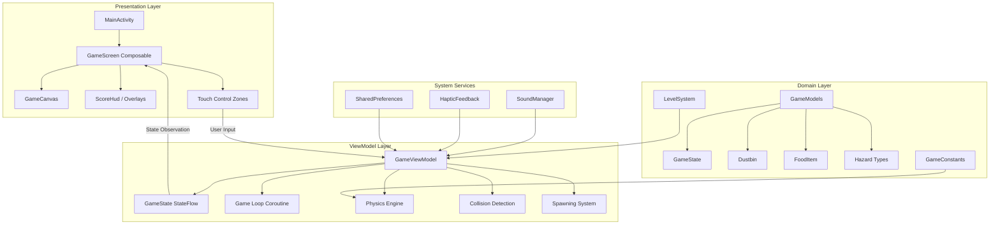
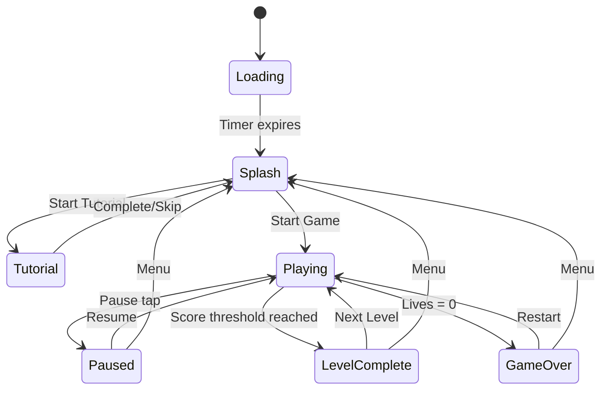
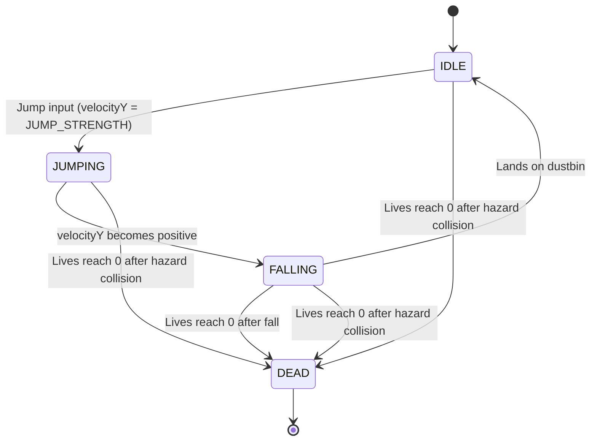

# Design Document: Alley Cat Game

## Overview

This design document describes the technical architecture for the Alley Cat Android game — a side-scrolling platformer where the player controls a cat jumping between dustbins in an alley environment. The game is built with Kotlin and Jetpack Compose, using an MVVM architecture with a coroutine-based game loop running at ~60 FPS.

The codebase now fully implements all 16 requirements including core movement, jumping, landing, hazard avoidance, level progression, sound, haptic feedback, food item collection, rival cat escape mechanics, tutorial system, and auto-pause on app background.

### Key Design Decisions

1. **MVVM with StateFlow**: Game state is a single immutable `GameState` data class, updated atomically via `StateFlow.update {}`. This ensures thread safety and enables Compose recomposition on state changes.
2. **Coroutine-based game loop**: A `viewModelScope.launch` coroutine ticks at 16ms intervals (~60 FPS), processing physics, collisions, and spawning each frame.
3. **Logical coordinate system**: All game objects use a logical coordinate space (1080×1000) that scales to the device screen via `canvasScale`, ensuring consistent behavior across screen sizes.
4. **Pure game logic separation**: Physics calculations, collision detection, and scoring logic are pure functions operating on immutable state, making them testable without Android framework dependencies.

## Architecture



### Data Flow

1. **Input**: Touch events in Compose control zones call ViewModel methods (`moveLeft()`, `jump()`, etc.)
2. **Processing**: The game loop coroutine calls `update()` each tick, computing new state from current state + physics + collisions
3. **Output**: `_gameState.update { ... }` emits new immutable state; Compose recomposes affected UI elements

### Component Responsibilities

| Component | Responsibility |
|-----------|---------------|
| `MainActivity` | Activity lifecycle, initializes SoundManager/HapticFeedback, auto-pauses on background, hosts Compose UI |
| `GameScreen` | Orchestrates overlays, control zones, tutorial callbacks, and canvas based on game state |
| `GameCanvas` | Renders all game objects (background, dustbins, hazard warnings, food items, cat) using Canvas draw calls with logical-to-screen scaling |
| `GameViewModel` | Owns game state, runs game loop, processes physics, collisions, food spawning/collection, hazard escape mechanics |
| `GameModels` | Defines immutable data classes for all game entities |
| `GameConstants` | Central repository of tuning values (physics, spawning, scoring) |
| `LevelSystem` | Provides level-specific configuration (speed, hazard chance, score thresholds) |
| `SoundManager` | Thread-safe ToneGenerator wrapper for sound effects |
| `HapticFeedback` | API-level-aware vibration pattern player |

## Components and Interfaces

### GameViewModel

```kotlin
class GameViewModel(application: Application) : AndroidViewModel(application) {
    // Public API
    fun startGame()
    fun startNextLevel()
    fun startTutorial()
    fun advanceTutorial()
    fun onTutorialMoveLeft()   // Tracks left movement for tutorial step 1
    fun onTutorialMoveRight()  // Tracks right movement for tutorial step 1
    fun skipTutorial()         // Exits tutorial without marking complete
    fun jump()
    fun moveLeft()
    fun stopMoveLeft()
    fun moveRight()
    fun stopMoveRight()
    fun togglePause()          // Works when game started & not game over (regardless of pause state)
    fun resume()
    fun resetToHome()
    fun showInstructions()
    fun hideInstructions()
    fun closeLevelComplete()

    // Internal game loop
    private fun gameLoop()
    private fun update()  // Main tick: physics, collisions, spawning, food, hazard warnings
    private fun loseLife(state: GameState): GameState  // Returns state unchanged if isTutorial
    private fun generateInitialDustbins(): List<Dustbin>  // Assigns food/hazard with mutual exclusion
    private fun stateIsActionable(): Boolean
    private fun saveHighScore(score: Int)
}
```

### Physics Engine (within update())

The physics engine handles:
- **Horizontal movement**: Constant speed (CAT_SPEED) while input held, clamped to screen bounds
- **Vertical physics**: Velocity += GRAVITY each frame; position += velocity
- **Landing detection**: When cat crosses DUSTBIN_TOP_Y downward and overlaps a bin horizontally
- **Fall detection**: When cat Y exceeds FALL_OFF_THRESHOLD

### Collision Detection

```kotlin
// Dustbin landing collision
fun isLandingOnBin(catX: Float, catWidth: Float, bin: Dustbin): Boolean {
    return catX + catWidth > bin.x && catX < bin.x + bin.width
}

// Hazard side collision
fun isCollidingWithHazard(catX: Float, catY: Float, catWidth: Float, bin: Dustbin): Boolean {
    if (!bin.hasHazard || bin.hazardYOffset <= HAZARD_COLLISION_THRESHOLD) return false
    val hazardLeft = bin.x + (bin.width / 2) - (HAZARD_WIDTH / 2)
    val hazardRight = hazardLeft + HAZARD_WIDTH
    return catX + catWidth > hazardLeft && catX < hazardRight && catY > DUSTBIN_TOP_Y - 100f
}

// Food item collision
fun isCollidingWithFood(catX: Float, catY: Float, catWidth: Float, catHeight: Float, food: FoodItem): Boolean {
    return catX + catWidth > food.x && catX < food.x + food.width &&
           catY + catHeight > food.y && catY < food.y + food.height
}
```

### Spawning System

```kotlin
// Dustbin spawning parameters
data class SpawnConfig(
    val minDistance: Float = MIN_SPAWN_DISTANCE,  // 450f
    val maxDistance: Float = MAX_SPAWN_DISTANCE,  // 750f
    val spawnThreshold: Float = SPAWN_THRESHOLD_X, // 2000f
    val hazardChance: Float,  // Level-dependent
    val foodChance: Float     // Level-dependent, only on non-hazard bins
)
```

### LevelSystem

```kotlin
data class LevelData(
    val level: Int,
    val name: String,
    val startingSpeed: Float,
    val maxSpeed: Float,
    val baseHazardChance: Float,
    val scoreToNext: Int,        // Level 4 = 350, Mystery = 500 + (level-4)*100
    val lives: Int,
    val description: String,
    val foodSpawnChance: Float   // Probability of food on non-hazard bins (L1:0.3, L2:0.25, L3:0.2, L4:0.15, Mystery:0.1)
)
```

### SoundManager Interface

```kotlin
object SoundManager {
    fun init()
    fun release()
    fun isInitialized(): Boolean
    fun playJumpSound()        // Ascending beep, 50ms
    fun playDeathSound()       // Descending tone, 150ms
    fun playScoreBonus()       // Celebratory pip, 80ms
    fun playLevelUp()          // Triumphant confirm, 300ms
    fun playLandingSound()     // Soft confirm, 100ms (plays on every landing)
    fun playHazardWarning()    // Warning tone, 200ms
    fun playFoodCollected()    // Reward chime, 60ms
}
```

### HapticFeedback Interface

```kotlin
object HapticFeedback {
    fun init(context: Context)
    fun release()
    fun isAvailable(): Boolean
    fun landingFeedback()          // 50ms single pulse
    fun collisionFeedback()        // 150ms + 100ms gap + 150ms double pulse
    fun streakBonusFeedback()      // 100ms + 50ms gap + 100ms moderate amplitude
    fun levelCompleteFeedback()    // 100ms × 3 with 100ms gaps
    fun hazardWarningFeedback()    // 50ms + 50ms gap + 50ms warning
}
```

## Data Models

### GameState

```kotlin
data class GameState(
    // Cat position and physics
    val catY: Float = 0f,
    val catX: Float = 200f,
    val catState: CatState = CatState.IDLE,
    val velocityY: Float = 0f,

    // Scoring
    val score: Int = 0,
    val highScore: Int = 0,
    val streak: Int = 0,

    // Lives and progression
    val lives: Int = INITIAL_LIVES,
    val currentLevel: Int = 1,

    // Game flow states
    val isGameOver: Boolean = false,
    val isGameStarted: Boolean = false,
    val isLoading: Boolean = true,
    val isPaused: Boolean = false,
    val showInstructions: Boolean = false,
    val showLevelComplete: Boolean = false,

    // World objects
    val dustbins: List<Dustbin> = emptyList(),
    val foodItems: List<FoodItem> = emptyList(),

    // Movement
    val gameSpeed: Float = 10f,
    val distanceTraveled: Float = 0f,
    val movingLeft: Boolean = false,
    val movingRight: Boolean = false,

    // Tutorial
    val isTutorial: Boolean = false,
    val tutorialStep: Int = 0,       // 0=not started, 1=move, 2=jump, 3=land, 4=done
    val tutorialCompleted: Boolean = false,
    val tutorialMovedLeft: Boolean = false,   // Tracks left movement for step 1
    val tutorialMovedRight: Boolean = false   // Tracks right movement for step 1
)
```

### FoodItem

```kotlin
data class FoodItem(
    val id: String = UUID.randomUUID().toString(),
    val x: Float,
    val y: Float,
    val width: Float = 60f,
    val height: Float = 60f,
    val velocityY: Float = -15f,  // Initial upward velocity
    val isCollected: Boolean = false,
    val sourceDustbinId: String,  // Tracks which bin spawned it
    val foodType: FoodType = FoodType.FISH,
    val spawnTimeMs: Long = System.currentTimeMillis()
)
```

### Dustbin

```kotlin
data class Dustbin(
    val id: String = UUID.randomUUID().toString(),
    val x: Float,
    val width: Float = 200f,
    val height: Float = 250f,
    val hasHazard: Boolean = false,
    val hazardType: HazardType = HazardType.NONE,
    val hazardYOffset: Float = 0f,       // 0f = hidden, 1f = fully visible
    val hasFood: Boolean = false,        // Whether this bin contains food
    val foodCollected: Boolean = false,   // Whether food was already collected
    val hazardWarned: Boolean = false,    // Whether hazard warning was triggered
    val hazardEscapeFrames: Int = 0       // Frame counter for escape window
)
```

### Enums

```kotlin
enum class CatState { IDLE, JUMPING, FALLING, DEAD }
enum class HazardType { NONE, DOG, CRAZY_CAT }
enum class FoodType { FISH, MILK, CHEESE }
```

### State Transition Diagram



### Cat State Machine



## Correctness Properties

*A property is a characteristic or behavior that should hold true across all valid executions of a system — essentially, a formal statement about what the system should do. Properties serve as the bridge between human-readable specifications and machine-verifiable correctness guarantees.*

### Property 1: Horizontal movement is bounded and constant-rate

*For any* valid game state with the cat at position catX, if movingLeft is true then the new catX equals max(catX - CAT_SPEED, CAT_SCREEN_PADDING), and if movingRight is true then the new catX equals min(catX + CAT_SPEED, VIEWPORT_WIDTH - CAT_WIDTH - CAT_SCREEN_PADDING). If neither flag is set, catX remains unchanged.

**Validates: Requirements 1.1, 1.2, 1.3, 1.4**

### Property 2: Inputs are ignored when game is not actionable

*For any* game state where isPaused=true, isGameOver=true, showLevelComplete=true, isLoading=true, or isGameStarted=false, calling jump(), moveLeft(), or moveRight() shall not alter the cat's position, velocity, or state.

**Validates: Requirements 1.5, 12.6**

### Property 3: Jump only applies from IDLE state

*For any* game state where catState is IDLE, calling jump() shall set velocityY to JUMP_STRENGTH and catState to JUMPING. For any state where catState is JUMPING or FALLING, calling jump() shall leave velocityY and catState unchanged.

**Validates: Requirements 2.1, 2.3, 2.5**

### Property 4: Gravity is applied every frame while airborne

*For any* game state where catState is JUMPING or FALLING and the game is not paused, after one update tick the new velocityY shall equal the previous velocityY + GRAVITY.

**Validates: Requirements 2.2**

### Property 5: Cat transitions from JUMPING to FALLING when velocity becomes positive

*For any* game state where catState is JUMPING and velocityY + GRAVITY > 0 (velocity crosses from negative to positive), after one update tick the catState shall be FALLING.

**Validates: Requirements 2.4**

### Property 6: Successful landing awards exactly base points and sets IDLE

*For any* game state where the cat is descending (positive velocityY), crosses DUSTBIN_TOP_Y, and horizontally overlaps a non-hazard dustbin, the score shall increase by POINTS_PER_LANDING and catState shall become IDLE with velocityY = 0.

**Validates: Requirements 3.1, 3.2**

### Property 7: Streak increments on landing on a distinct dustbin

*For any* sequence of successful landings where each landing is on a dustbin with a different ID than the previous landing, the streak counter shall increment by 1 for each such landing.

**Validates: Requirements 3.3, 10.1**

### Property 8: Life loss resets cat position, velocity, and streak

*For any* game state with lives > 1, when a life is lost the resulting state shall have catX = VIEWPORT_WIDTH/2, catY = GROUND_Y, velocityY = 0, catState = IDLE, and streak = 0.

**Validates: Requirements 3.4, 8.2, 8.3, 10.5**

### Property 9: Zero lives triggers game over

*For any* game state with lives = 1, when a life loss event occurs, the resulting state shall have isGameOver = true and lives = 0.

**Validates: Requirements 8.4**

### Property 10: Landing on a hazard bin with visible hazard loses a life

*For any* game state where the cat lands on a dustbin that has hasHazard=true and hazardYOffset > HAZARD_VISIBLE_THRESHOLD, the result shall be a life loss (not a score increase).

**Validates: Requirements 3.7**

### Property 11: Hazard collision only activates at or above threshold

*For any* hazard with hazardYOffset < HAZARD_COLLISION_THRESHOLD (0.5), collision detection shall not trigger regardless of the cat's proximity to the hazard.

**Validates: Requirements 5.2, 6.2, 6.3**

### Property 12: Hazard emergence animates at constant rate

*For any* dustbin with hasHazard=true and x < HAZARD_SPAWN_THRESHOLD_X, after one update tick the hazardYOffset shall increase by HAZARD_ANIMATION_SPEED (0.05), capped at 1.0.

**Validates: Requirements 5.1**

### Property 13: Hazard type is always DOG or CRAZY_CAT when hasHazard is true

*For any* dustbin in the game state where hasHazard=true, the hazardType shall be either DOG or CRAZY_CAT (never NONE).

**Validates: Requirements 5.8**

### Property 14: Mutual exclusion of hazard and food on same dustbin

*For any* dustbin in the game state, it shall never have both hasHazard=true and hasFood=true simultaneously.

**Validates: Requirements 5.9**

### Property 15: Food spawns only on non-hazard bins with available food

*For any* dustbin with hasFood=true, hasHazard=false, and foodCollected=false, when the cat successfully lands on it, a FoodItem shall be added to the game state with sourceDustbinId matching the bin's ID.

**Validates: Requirements 4.1**

### Property 16: Food items follow gravity physics

*For any* FoodItem in the game state, after one update tick its velocityY shall increase by GRAVITY and its y position shall increase by its velocityY (same physics as the cat).

**Validates: Requirements 4.2**

### Property 17: Food collection awards bonus points and removes item

*For any* game state where the cat's bounding box overlaps a FoodItem's bounding box, the score shall increase by 5 and the FoodItem shall be removed from the foodItems list.

**Validates: Requirements 4.3**

### Property 18: Food items are removed when off-screen

*For any* FoodItem with y > FALL_OFF_THRESHOLD, it shall be removed from the game state in the next update tick.

**Validates: Requirements 4.4**

### Property 19: No duplicate food from same dustbin

*For any* dustbin with foodCollected=true, no new FoodItem shall be spawned from that dustbin regardless of subsequent landings.

**Validates: Requirements 4.6**

### Property 20: Dustbins scroll leftward at game speed

*For any* dustbin in an active (non-paused) game state, after one update tick its x position shall decrease by exactly the current gameSpeed.

**Validates: Requirements 7.1**

### Property 21: Off-screen dustbins are removed

*For any* dustbin where x + width < DUSTBIN_OUT_OF_BOUNDS_LEFT (-200), it shall be removed from the dustbins list in the next update tick.

**Validates: Requirements 7.3**

### Property 22: Spawned dustbin gap is within bounds

*For any* newly spawned dustbin, the horizontal distance from the previous dustbin shall be between MIN_SPAWN_DISTANCE (450) and MAX_SPAWN_DISTANCE (750) pixels (scaled by speed multiplier).

**Validates: Requirements 7.2, 7.4**

### Property 23: Game speed increases on landing up to maximum

*For any* successful landing, the gameSpeed shall increase by SPEED_INCREASE_PER_LANDING (0.1), and the gameSpeed shall never exceed MAX_GAME_SPEED (25).

**Validates: Requirements 7.5**

### Property 24: Level complete triggers at score threshold

*For any* game state where the score reaches or exceeds the current level's scoreToNext value after a landing, showLevelComplete shall become true.

**Validates: Requirements 9.1**

### Property 25: Streak bonus awards extra points at threshold

*For any* game state where streak >= STREAK_BONUS_THRESHOLD (5), a successful landing shall award POINTS_PER_LANDING + BONUS_POINTS (1 + 1 = 2) total points.

**Validates: Requirements 10.2**

### Property 26: Pause freezes all game state

*For any* game state where isPaused=true, calling update() shall return the state completely unchanged (all positions, velocities, scores, and object lists remain identical).

**Validates: Requirements 12.1, 12.3**

### Property 27: High score updates when current score exceeds it

*For any* game state where score > highScore after a scoring event, the highScore shall be updated to equal the current score.

**Validates: Requirements 16.3**

### Property 28: Tutorial mode prevents life loss

*For any* game state where isTutorial=true, no event (hazard collision, falling off screen) shall decrease the lives counter.

**Validates: Requirements 11.4**

### Property 29: Lives reset to 3 on new level

*For any* level transition (calling startNextLevel()), the resulting state shall have lives equal to the new level's configured lives value (3).

**Validates: Requirements 9.5**

## Error Handling

### Physics Edge Cases

| Scenario | Handling |
|----------|----------|
| Cat position goes out of bounds | Clamped to [CAT_SCREEN_PADDING, VIEWPORT_WIDTH - CAT_WIDTH - CAT_SCREEN_PADDING] |
| Velocity exceeds reasonable bounds | Gravity is constant; terminal velocity is bounded by FALL_OFF_THRESHOLD detection |
| No dustbins on screen | Spawning system generates new bins when list is empty or last bin < SPAWN_THRESHOLD_X |
| Game loop exception | Caught and logged; game continues from last valid state |

### Resource Management

| Resource | Initialization | Cleanup | Failure Mode |
|----------|---------------|---------|--------------|
| ToneGenerator | `SoundManager.init()` in onCreate | `SoundManager.release()` in onDestroy | Log error, continue without sound |
| Vibrator | `HapticFeedback.init(context)` in onCreate | `HapticFeedback.release()` in onDestroy | Skip vibration if unavailable |
| SharedPreferences | Lazy init in ViewModel constructor | N/A (system managed) | Default to 0 for high score |
| Game loop coroutine | `viewModelScope.launch` on game start | `gameJob?.cancel()` on game end/ViewModel clear | Break loop on exception |

### State Recovery

- **App backgrounded during gameplay**: Auto-pause triggered; state preserved in ViewModel (survives configuration changes)
- **Process death**: High score persisted via SharedPreferences; game progress lost (acceptable for arcade game)
- **ViewModel cleared**: All coroutines cancelled via `onCleared()`; no resource leaks

### Input Validation

- All touch inputs gated by `stateIsActionable()` check
- Movement flags are boolean — no invalid values possible
- Jump only fires from IDLE state — prevents physics corruption
- Pause/resume are idempotent toggles

## Testing Strategy

### Property-Based Testing

**Library**: [Kotest](https://kotest.io/) with the property testing module (`kotest-property`)

Property-based tests will validate the 29 correctness properties defined above. Each test generates random valid game states and verifies that the property holds across 100+ iterations.

**Configuration**:
- Minimum 100 iterations per property test
- Custom generators for `GameState`, `Dustbin`, `FoodItem`, and `CatState`
- Tests run as JVM unit tests (no Android framework dependency needed for pure logic)

**Tag format**: `Feature: alley-cat-game, Property {number}: {property_text}`

**Key generators needed**:
- `Arb.gameState()` — generates valid GameState with random positions, velocities, scores
- `Arb.dustbin()` — generates dustbins with random positions, hazard configurations
- `Arb.foodItem()` — generates food items at various lifecycle stages
- `Arb.catPosition()` — generates valid (catX, catY) pairs within bounds

### Unit Tests (Example-Based)

Unit tests cover specific examples, configuration values, and edge cases:

- Level configuration values (speeds, hazard chances, score thresholds)
- Initial game state values (3 lives, streak=0, score=0)
- Tutorial step progression (1→2→3→4→complete)
- Initial dustbin generation (correct count and spacing)
- Game over overlay displays correct scores
- Sound/haptic initialization and cleanup

### Integration Tests

Integration tests verify side effects and Android framework interactions:

- SoundManager plays correct tones for each event
- HapticFeedback produces correct vibration patterns
- SharedPreferences correctly persists and loads high scores
- Compose UI renders correct overlays for each game state
- Touch control zones map to correct ViewModel methods

### Test Organization

```
app/src/test/java/com/example/alleycat/
├── properties/
│   ├── MovementPropertyTest.kt      (Properties 1-2)
│   ├── JumpPhysicsPropertyTest.kt   (Properties 3-5)
│   ├── LandingPropertyTest.kt       (Properties 6-10)
│   ├── HazardPropertyTest.kt        (Properties 11-14)
│   ├── FoodPropertyTest.kt          (Properties 15-19)
│   ├── WorldPropertyTest.kt         (Properties 20-23)
│   ├── ProgressionPropertyTest.kt   (Properties 24-25, 27, 29)
│   └── GameFlowPropertyTest.kt      (Properties 26, 28)
├── unit/
│   ├── LevelSystemTest.kt
│   ├── GameStateInitTest.kt
│   └── TutorialFlowTest.kt
└── generators/
    ├── GameStateArb.kt
    ├── DustbinArb.kt
    └── FoodItemArb.kt

app/src/androidTest/java/com/example/alleycat/
├── SoundManagerIntegrationTest.kt
├── HapticFeedbackIntegrationTest.kt
├── HighScorePersistenceTest.kt
└── ui/
    ├── GameScreenTest.kt
    └── OverlayTest.kt
```

### Dependencies to Add

```kotlin
// In build.gradle.kts
testImplementation("io.kotest:kotest-runner-junit5:5.8.0")
testImplementation("io.kotest:kotest-assertions-core:5.8.0")
testImplementation("io.kotest:kotest-property:5.8.0")
testImplementation("io.mockk:mockk:1.13.8")
```

